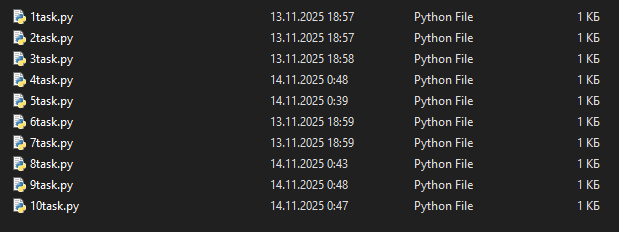
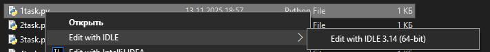
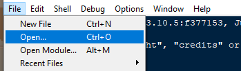

# Python 2030 — Сборник задач для изучения Python

Этот репозиторий создан на основе заданий с сайта  
[https://www.python2030.ru](https://www.python2030.ru)  
(Верстальщику сайта — низкий поклон и поцелуи в ручки ❤️)


Скачать :
[https://github.com/gouken27/Firiend_work/archive/refs/heads/main.zip](https://github.com/gouken27/Firiend_work/archive/refs/heads/main.zip)

## Цель проекта
Собрать в одном месте все задачи с курса Python 2030, оформить их в удобные блоки, добавить портативную IDE и подробные инструкции — чтобы можно было учиться и отрабатывать навыки без лишних сложностей.

## Структура проекта

```
|   Manual.md       — Конспект с основными теоретическими знаниями, которые должен знать каждый программист
│   README.md       — Это описание проекта (ты его сейчас читаешь)
|
├───IDE             — Портативная версия Python с простым GUI-редактором
|    *exe
|
└───scr             — Основная разработка
    ├───Основы_python
    |       *.py
    ├───Работа_с_файлами
    |       *.py    — В каждом блоке обычно один файл с несколькими задачами (или отдельные файлы)
    ├───Работа_со_строками_и_словарики
    |       *.py
    ├───Работаа_с_графикой_и_функции
    |       *.py
    ├───Базовые_алгоритмы_на_списках
    |       *.py
    └───Циклы_for_и_while
            *.py
```

Всего **6 блоков**, в каждом от 4 до 10 задач разной сложности.

## Как запустить код?

Проект полностью работает на **Windows 7 / 10 / 11** без установки Python.

### Способ 1 — Быстро и просто (рекомендуется новичкам)
1. Откройте нужную папку в `src/` (например, `src/block_1/`)
2. Найдите файл `.py` с задачами



3. Щёлкните по нему **правой кнопкой мыши** → «Изменить с помощью IDLE» (или «Открыть с помощью» → выбрать Python)



4. В открывшемся окне нажмите **F5** или меню **Run → Run Module**


Готово! Код выполнится.

### Способ 2 — Через портативную IDE (если Python не установлен)
1. Зайдите в папку `IDE/`
2. Запустите `python_launcher.exe` (можно даже с флешки!)


3. В меню программы выберите **File → Open**



4. Перейдите в нужную папку внутри `src/`, выберите `.py` файл


5. Нажмите **F5** или кнопку **Run**


### Способ 3 — Через командную строку (для тех, кто уже в теме)
```bash
cd src/block_3
python tasks.py
```

## Для кого этот репозиторий?
- Новичков, которые только начинают изучать Python
- Тех, кто проходит курс Python 2030 и хочет иметь все задачи под рукой
- Преподавателей и наставников — как готовый набор задач для учеников

## Полезные ссылки
- Оригинальный курс: https://www.python2030.ru/ш
- Конспект теории: [`Manual.md`](./Manual.md)

---

**Используйте этот репозиторий для практики, повторения и закрепления материала.**  
Удачи в изучении Python! 🐍✨